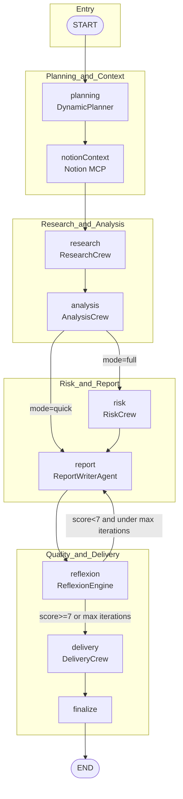

# Multi-Agent Workflow: LLM Call Order and Dependencies

This document describes the end-to-end flow from **planning → research → analysis → report → evaluation/reflection → delivery**, including LLM call counts per step and data dependencies.

---

## 1. Overall Flow (Mermaid)

---

## 2. Node-by-Node LLM Call Summary

| # | Node | Source | Component | LLM calls | Notes |
|---|------|--------|-----------|-----------|-------|
| 1 | **planning** | `graph/nodes.ts` → `DynamicPlanner` | `createInitialPlan()` | **1** | Produces execution plan (JSON task list) from company, query, mode |
| 2 | **notionContext** | `graph/nodes.ts` | `notionSearchPastAnalyses` (MCP) | **0** | Fetches past analyses from Notion; no direct LLM call |
| 3 | **research** | `graph/nodes.ts` → `ResearchCrew` | Researcher → Data Collector → Synthesizer | **3** | Sequential: Web Researcher, Financial Data Collector, Synthesizer (1 invoke each) |
| 4 | **analysis** | `graph/nodes.ts` → `AnalysisCrew` | Financial / Market / Tech analysts | **3** (parallel) | `Promise.all`: three analysts, 1 invoke each |
| 5 | **risk** | `graph/nodes.ts` → `RiskCrew` | Risk Analyst + Compliance Analyst | **2** | Sequential: risk assessment (1), compliance/regulatory (1); runs only when mode=full |
| 6 | **report** | `graph/nodes.ts` → `ReportWriterAgent` | Generate or Revise | **1** | First pass: `generate()` once; on retry: `revise()` once |
| 7 | **reflexion** | `graph/nodes.ts` → `ReflexionEngine` | Evaluate + Reflect | **2** | Inside `evaluateAndReflect()`: evaluate (1), then reflect (1) |
| 8 | **delivery** | `graph/nodes.ts` → `DeliveryCrew` | Knowledge Manager + Distribution Coordinator | **2** | Notion save (1 invoke), email/calendar (1 invoke) |
| 9 | **finalize** | `graph/nodes.ts` | State only | **0** | No LLM; copies draftReport to finalReport |

---

## 3. Total LLM Calls per Full Run (Estimate)

- **mode = "full"** (includes risk node):  
  `1 + 3 + 3 + 2 + 1 + 2 + 2 = 14` calls (first report pass, no retry)
- **mode = "quick"** (skips risk):  
  `1 + 3 + 3 + 0 + 1 + 2 + 2 = 12` calls
- **If Reflexion triggers a retry**: each extra round adds **report(1) + reflexion(2) = 3** calls, up to `WorkflowConfig.maxIterations` (default 3).

---

## 4. Data Dependencies (Inputs and Outputs)

| Node | Main inputs (from state) | Writes to state |
|------|--------------------------|-----------------|
| planning | company, query, mode | executionPlan, currentPhase |
| notionContext | company | historicalContext |
| research | company, query | researchData, researchSummary, researchSources |
| analysis | company, researchSummary | financialAnalysis, marketAnalysis, techAnalysis |
| risk | company, researchSummary, financialAnalysis, marketAnalysis | riskAssessment, riskScore |
| report | company, researchSummary, financialAnalysis, marketAnalysis, techAnalysis, riskAssessment, riskScore, reflexionMemory; (on retry) draftReport, qualityFeedback, humanFeedback | draftReport |
| reflexion | draftReport, iterationCount | qualityScore, qualityFeedback, reflexionMemory, iterationCount |
| delivery | company, draftReport/finalReport, riskScore | deliveryStatus |
| finalize | draftReport | finalReport, currentPhase |

---

## 5. Conditional Branches

1. **analysis → risk / report**  
   - `mode === "quick"` → go directly to **report**, skip **risk** (2 fewer LLM calls).
2. **reflexion → report / delivery**  
   - If `qualityScore >= 7` or `maxIterations` reached → **delivery**.  
   - Otherwise → back to **report** for retry (report uses `reflexionMemory` and feedback in `revise()`).

---

## 6. LLM Components Not in the Main Graph

- **ProcessRewardModel** (`skills/processReward.ts`): Step-level quality scoring (1 LLM call per step). Not used in the main workflow; can be used for fine-grained step evaluation or offline analysis.
- **DynamicPlanner.adaptPlan()**: Used when dynamically adjusting the plan (re-plan after a task completes). The current graph uses a one-shot initial plan; if you add “re-plan after step” logic between nodes, extra LLM calls will occur here.

---

## 7. Config and Entry Points

- **LLM config**: `config.ts` (`createLLM`, DeepSeek baseURL/apiKey, model names, temperature).
- **Graph definition**: `graph/workflow.ts` (`buildWorkflow()`).
- **Node implementations**: `graph/nodes.ts` (each node calls crews/agents/skills).
- **Run entry**: `runWorkflow({ company, query?, mode?, stream? })` in `graph/workflow.ts`.

---

*Generated from the current codebase; if the workflow or nodes change, update this doc to match.*
