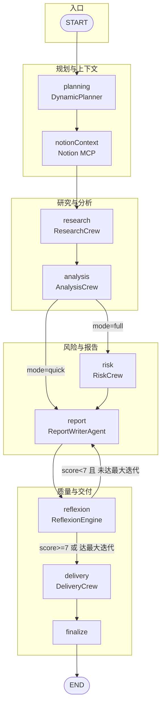

# 多智能体工作流：LLM 调用顺序与依赖

本文档描述从**规划 → 研究 → 分析 → 报告 → 评估/反思 → 交付**的完整流程，以及每一步的 LLM 调用次数与数据依赖。

---

## 一、整体流程图（Mermaid）

---

## 二、节点与 LLM 调用明细表

| 序号 | 节点名 | 源码位置 | 调用的组件 | LLM 调用次数 | 说明 |
|------|--------|-----------|------------|---------------|------|
| 1 | **planning** | `graph/nodes.ts` → `DynamicPlanner` | `createInitialPlan()` | **1** | 根据 company、query、mode 生成执行计划（JSON 任务列表） |
| 2 | **notionContext** | `graph/nodes.ts` | `notionSearchPastAnalyses` (MCP) | **0** | 拉取 Notion 历史分析，不直接调 LLM |
| 3 | **research** | `graph/nodes.ts` → `ResearchCrew` | 研究员 → 数据收集 → 综合 | **3** | 串行：Web 研究员、财务数据收集、综合员各 1 次 invoke |
| 4 | **analysis** | `graph/nodes.ts` → `AnalysisCrew` | 财务 / 市场 / 技术分析师 | **3**（并行） | `Promise.all` 三个分析师各 1 次 invoke |
| 5 | **risk** | `graph/nodes.ts` → `RiskCrew` | 风险分析师 + 合规分析师 | **2** | 串行：风险评估 1 次、合规/监管 1 次（仅 mode=full 时执行） |
| 6 | **report** | `graph/nodes.ts` → `ReportWriterAgent` | 生成 或 修订 | **1** | 首次：`generate()` 一次；重试时：`revise()` 一次 |
| 7 | **reflexion** | `graph/nodes.ts` → `ReflexionEngine` | 评估 + 反思 | **2** | `evaluateAndReflect()` 内：先评估 1 次，再反思 1 次 |
| 8 | **delivery** | `graph/nodes.ts` → `DeliveryCrew` | 知识管理 + 分发协调 | **2** | 存 Notion 1 次 invoke，邮件/日历 1 次 invoke |
| 9 | **finalize** | `graph/nodes.ts` | 仅写 state | **0** | 无 LLM，只把 draftReport 写入 finalReport |

---

## 三、单次完整流程的 LLM 调用次数（估算）

- **mode = "full"**（含 risk 节点）：  
  `1 + 3 + 3 + 2 + 1 + 2 + 2 = 14` 次（首轮报告，无重试）
- **mode = "quick"**（跳过 risk）：  
  `1 + 3 + 3 + 0 + 1 + 2 + 2 = 12` 次
- 若 **Reflexion 触发重试**：每多一轮会多执行 **report(1) + reflexion(2) = 3** 次，最多到 `WorkflowConfig.maxIterations`（默认 3）轮。

---

## 四、数据依赖关系（谁消费谁）

| 节点 | 主要输入（来自 state） | 输出写回 state |
|------|------------------------|----------------|
| planning | company, query, mode | executionPlan, currentPhase |
| notionContext | company | historicalContext |
| research | company, query | researchData, researchSummary, researchSources |
| analysis | company, researchSummary | financialAnalysis, marketAnalysis, techAnalysis |
| risk | company, researchSummary, financialAnalysis, marketAnalysis | riskAssessment, riskScore |
| report | company, researchSummary, financialAnalysis, marketAnalysis, techAnalysis, riskAssessment, riskScore, reflexionMemory, (重试时) draftReport, qualityFeedback, humanFeedback | draftReport |
| reflexion | draftReport, iterationCount | qualityScore, qualityFeedback, reflexionMemory, iterationCount |
| delivery | company, draftReport/finalReport, riskScore | deliveryStatus |
| finalize | draftReport | finalReport, currentPhase |

---

## 五、条件分支说明

1. **analysis → risk / report**  
   - `mode === "quick"` → 直接到 **report**，不执行 risk（少 2 次 LLM）。
2. **reflexion → report / delivery**  
   - `qualityScore >= 7` 或已达 `maxIterations` → **delivery**；  
   - 否则 → 回到 **report** 重试（report 会用 `reflexionMemory` 和 feedback 做 revise）。

---

## 六、未在主图中的 LLM 组件

- **ProcessRewardModel**（`skills/processReward.ts`）：按**步骤**做质量评分（每步 1 次 LLM），当前主工作流未使用，可用于细粒度步骤评估或离线分析。
- **DynamicPlanner.adaptPlan()**：在**动态调整计划**时使用（完成某任务后根据结果重规划），当前主图是“一次性初始计划”，若将来在节点间加入“执行完某步再规划”的逻辑，会在这里多出 LLM 调用。

---

## 七、配置文件与入口

- **LLM 统一配置**：`config.ts`（`createLLM`、DeepSeek baseURL/apiKey、模型名、temperature）。
- **图定义**：`graph/workflow.ts`（`buildWorkflow()`）。
- **节点实现**：`graph/nodes.ts`（各 node 内调用 crews/agents/skills）。
- **运行入口**：`graph/workflow.ts` 的 `runWorkflow({ company, query?, mode?, stream? })`。

---

*文档根据当前代码生成；若 workflow 或节点有改动，请以代码为准并同步更新此文档。*
